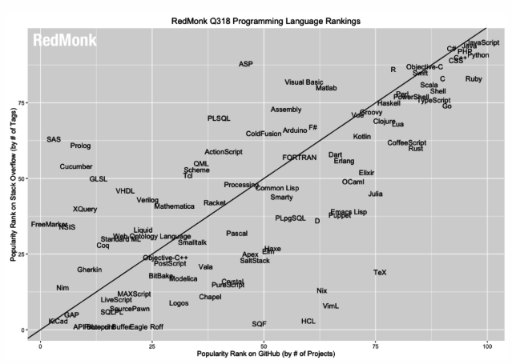
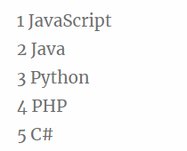

# ML Week 1
## 파이썬이란 무엇인가?

### 1. 누가 만들었는가?
  * 파이썬이란 1990년 암스테르담의 귀도 반 로섬(Guido Van Rossum)에 의해 만들어진 `인터프리터` 언어이다.
  > Interpreter vs compiler ?  우선 컴파일러는 전체를 모두 변환하여 실행합니다. 하지만 인터프리터의 경우 한 줄 단위로 변환 및 실행을 반복합니다. 이는 마치 번역하는 것과 비슷합니다.
### 2. 사전적 의미는?
  * 고대 신화 속의 파르나수스(Parnassus) 산의 동굴에 살던 큰 뱀으로서, 아폴로가 델파이에서 파이썬을 퇴치했다는 이야기가 전해지고 있다.
  * 
### 3. 점유율은? 사용 범위는?
  * TIOBE Index for April 2018
    * 해당 프로그래밍 언어를 이용하는 엔지니어 및 업체의 수와 Google, Bing,Yahoo 등의 검색 엔진을 통해 검색되는 결과물의 수를 바탕으로 순위를 결정한다. 따라서 TIOBE index는 C/C++이나 Java와 같이 전통적인 프로그래밍 언어의 순위를 높게 산정하는 경향이 있다.
    * 
    * 
  * RedMonk Programming Language Rankings June 2018
    * GitHub에서 해당 프로그래밍 언어로 작성된 소스 코드의 수와 Stack Overflow 에서 해당 프로그래밍 언어에 대한 논의가 이루어지고 있는 페이지수를 합산하여 순위를 결정한다. 따라서 얼마나 활발하게 해당 언어를 이용한 프로젝트가 진행되고 있고, 해당 언어에 대한 논의가 이루어지고 있는지에 따라 순뤼가 결정된다. 즉, 소스 코드의 배포가 활발하거나 많은 이슈가 있는 언어의 순위가 높게 산정되는 경향이 있다.
    * 
    * 
### 4. 장점은?
  * 읽고 사용하기 쉽다.  프로그램을 유지 보수하거나 개선하기 쉽다.
  * 비동기식 코딩  혼란스러운 자원 경쟁이나 교착상태가 발생하지 않는다.
  * 자바보다 뛰어난 멀티패러다임 접근방식  ?
  * Python은 C언어로 구현된 라이브러리를 , 그대로, 간단하게 사용할 수 있다.
### 5. 할 수 있는 것은?
  * 시스템 유틸리티 제작
  * GUI 프로그래밍
  * C/C++ 와의 결합
  * 웹 프로그래밍
  * 수치 연산 프로그래밍
  * 데이터베이스 프로그래밍
  * 데이터 분석, 사물 인터넷
### 6. 단점은?
  * 속도 느리다.
  * 모바일 컴퓨팅과 브라우저 부재  파이썬으로 개발된 application이 거의 없다.
### 7. 할 수 없는 것은?
  * 시스템과 밀접한 프로그래밍 영역
  * 모바일 프로그래밍
### 8. ML이란?
  * 컴퓨터가 사전에 미리 프로그램되어 있지 않고 데이터로부터 패턴을 학습하여 새로운 데이터에 대해 적절한 작업을 수행하는 일련의 알고리즘이나 처리 과정
  * 컴퓨터 과학(Computer Science), 통계(Statistics), 데이터 마이닝(Data Minig)분야와 밀접한 관련이 있다.
  * 
### 9. ML에 사용되는 이유는?
  * 파이썬은 데이터 과학 분야를 위한 표준 프로그래밍 언어가 되어 가고 있다. 파이썬은 범용 프로그래밍 언어의 장점은 물론 MATLAB과 R 같은 특정 분야를 위한 스크립팅 언어의 편리함을 가지고 있다.
  * 프로그래밍이 단순해진다.
    * 언어의 간소함, 읽는게 편하다.
  * 머신러닝 라이브러리가 있다.
    * 풍부한 머신러닝 라이브러리과 프레임워크가 제공된다. (Scikit-learn, TensorFlow, CNTk, 아파치 스파크 MLlib)
  * 메모리를 대신 관리한다.
    * 파이썬은 프로그래머 대신 세부적인 메모리 관리를 수행하므로 결과적으로 개발자에게 개발 관련 문제에 집중할 수 있는 정신적인 여유를 제공한다.
    * 머신러닝 앱은 파이썬의 메모리 관리 구조를 실제 연산 작업보다는 애플리케이션의 로직 또는 데이터 흐름 정리를 위한 용도로 더 활용된다.
  * 파이썬이 느려도 상관없다.
    * 파이썬이 가장 빠른 언어가 아닌데도 머신러닝 같은 연산 집약적인 작업에 사용하는 이유는 무엇일까?  연산 집약적인 작업을 처리하는 것은 파이썬이 아니다.  
    * 파이썬 머신러닝 애플리케이션에서 수행하는 실제 연산작업 대부분은 일반적으로 C, C++, Java 등으로 작성한다. 파이썬은 라이브러리를 통해 이를 정리하고 상호작용할 뿐이다.
